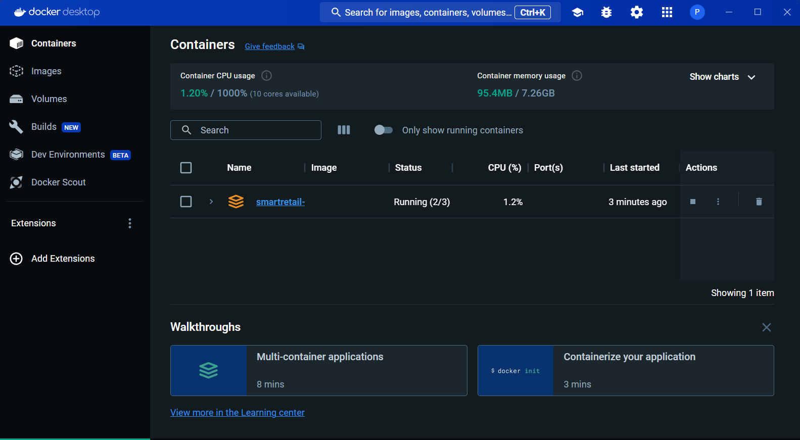
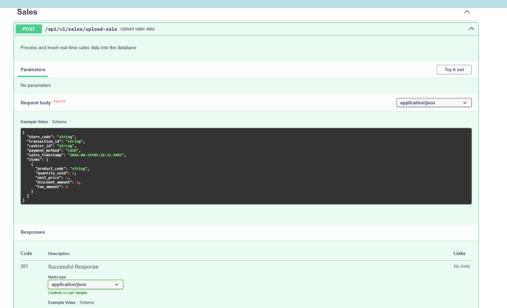
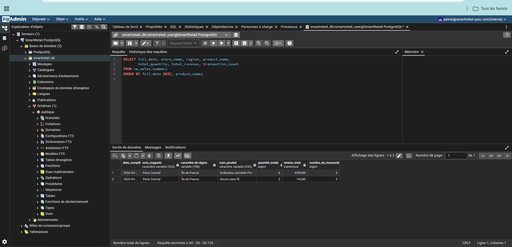
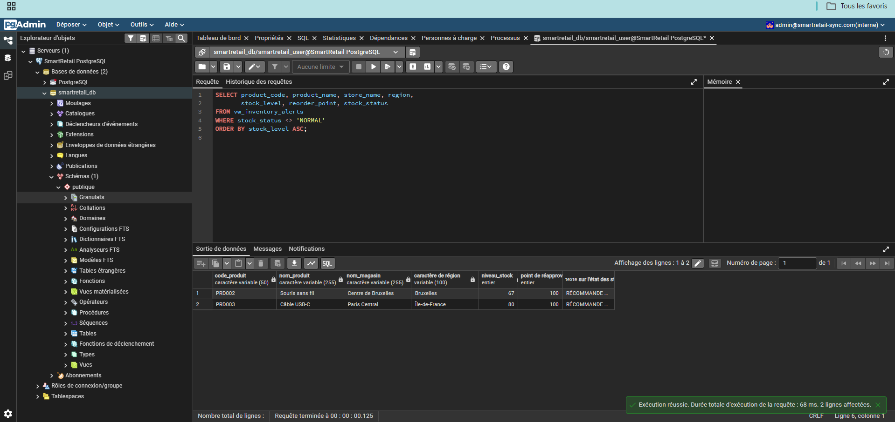
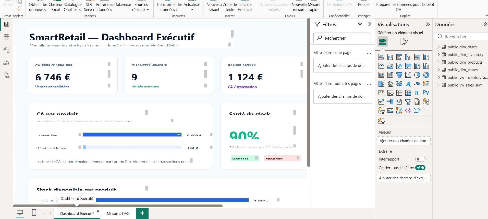

# SmartRetail-Sync

SmartRetail-Sync est un projet data engineering qui synchronise des ventes et des stocks en temps reel avec une API FastAPI, une base PostgreSQL en modele etoile, une interface pgAdmin et une preparation Power BI.

Le projet est pret a etre versionne sur GitHub sans les fichiers Power BI lourds ou generes.

## Objectif

Le projet permet de :

- ingerer des ventes via une API REST FastAPI ;
- stocker les donnees dans PostgreSQL avec un schema analytique ;
- exposer des vues SQL pretes pour Power BI ;
- suivre les stocks faibles et les alertes de reapprovisionnement ;
- preparer une architecture cloud Azure avec Key Vault, App Service et PostgreSQL Flexible Server.

## Architecture

```text
Clients / POS
    |
    v
FastAPI Backend
    |
    v
PostgreSQL
    |
    +-- fact_sales
    +-- dim_dates
    +-- dim_products
    +-- dim_stores
    +-- dim_inventory
    +-- vw_sales_summary
    +-- vw_inventory_alerts
    |
    v
Power BI Desktop
```

En local, les services tournent avec Docker Compose :

- Backend FastAPI : `http://localhost:8000`
- Documentation Swagger : `http://localhost:8000/api/v1/docs`
- pgAdmin : `http://localhost:5050`
- PostgreSQL : `localhost:5432`

## Captures

### Docker Compose



### Documentation API Swagger



### Requetes SQL dans pgAdmin





### Brouillon Power BI



## Stack

- Python 3.11
- FastAPI
- PostgreSQL 15
- Docker Compose
- pgAdmin
- Power BI Desktop
- Azure CLI, Azure Key Vault et App Service en preparation cloud

## Lancer le projet en local

```powershell
docker-compose up --build
```

Puis tester :

```powershell
python test_api.py
```

Endpoints principaux :

- `GET /health`
- `POST /api/v1/sales/upload-sale`
- `GET /api/v1/sales/summary`
- `GET /api/v1/inventory/low-stock`
- `PUT /api/v1/inventory/update`
- `GET /api/v1/inventory/by-product/{product_code}`

## Base de donnees

Le schema PostgreSQL est dans :

```text
database/schema.sql
```

Tables principales :

- `fact_sales`
- `dim_dates`
- `dim_products`
- `dim_stores`
- `dim_inventory`

Vues analytiques :

- `vw_sales_summary`
- `vw_inventory_alerts`

Des requetes de demonstration sont disponibles dans :

```text
database/demo_queries.sql
```

## Export Excel pour Power BI

Un export Excel peut etre genere depuis PostgreSQL :

```powershell
python database/export_to_excel.py
```

Le fichier genere est place dans `exports/`, dossier ignore par Git afin de ne pas pousser les artefacts volumineux.

## Power BI

Le rapport Power BI est volontairement exclu du depot GitHub :

- `powerbi/`
- `*.pbix`
- `*.pbit`
- `*.xlsx`

Ces fichiers sont des artefacts locaux et peuvent etre lourds. Le depot garde uniquement le code, les scripts SQL, la configuration Docker et la preparation cloud.

Connexion Power BI locale :

```text
Serveur : localhost
Base    : smartretail_db
Mode    : Import
User    : smartretail_user
```

## Azure

La partie Azure est preparee dans :

```text
infrastructure/setup.ps1
infrastructure/setup.sh
```

Elle prevoit :

- un Resource Group ;
- Azure Key Vault en mode Standard ;
- PostgreSQL Flexible Server ;
- App Service Plan et App Service ;
- Managed Identity pour acceder aux secrets Key Vault.

Etat actuel :

- Azure CLI a ete installe et verifie ;
- la connexion Azure fonctionne ;
- aucun deploiement cloud n'a ete effectue, car le compte teste ne dispose pas d'une subscription Azure active ;
- aucune carte bancaire n'est necessaire pour executer le projet en local.

Cette separation est volontaire : le projet reste demonstrable localement avec Docker, tout en montrant une architecture cloud prete a etre activee si une subscription Azure est disponible.

## Securite

Le depot ne doit pas contenir de secrets reels.

Fichiers et dossiers ignores :

- `.env`
- logs
- caches Python
- exports Excel
- fichiers Power BI

Le fichier `backend/.env.example` sert seulement de modele de configuration.

## Validation effectuee

Tests locaux effectues :

- demarrage Docker Compose ;
- connexion PostgreSQL ;
- acces pgAdmin ;
- execution de requetes SQL sur les vues analytiques ;
- test API complet avec `test_api.py` ;
- verification que les artefacts Power BI et Excel sont ignores par Git ;
- verification que la partie Azure est preparee mais non deployee faute de subscription.

## Structure

```text
SmartRetail-Sync/
|-- backend/
|   |-- src/
|   |-- requirements.txt
|   `-- .env.example
|-- database/
|   |-- schema.sql
|   |-- demo_queries.sql
|   `-- export_to_excel.py
|-- docs/
|-- infrastructure/
|   |-- setup.ps1
|   `-- setup.sh
|-- docker-compose.yml
|-- Dockerfile
|-- test_api.py
|-- test_sale.json
`-- README.md
```

## Justification de publication GitHub

Le depot peut etre pousse sur GitHub car :

- le code backend, SQL, Docker et infrastructure est versionnable ;
- les fichiers sensibles ou generes sont exclus par `.gitignore` ;
- le projet est testable localement sans Azure ;
- la partie Azure est documentee comme preparation cloud, pas comme deploiement deja realise ;
- les fichiers Power BI restent locaux pour eviter de publier des artefacts lourds.
